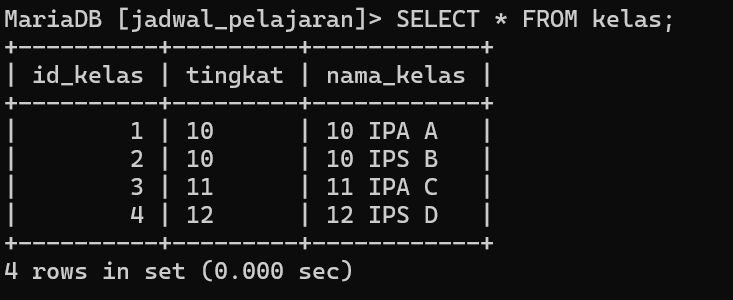
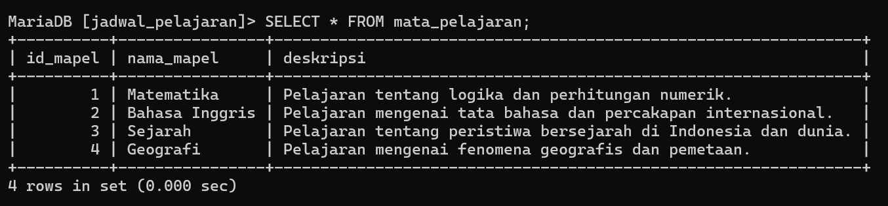
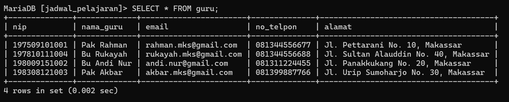
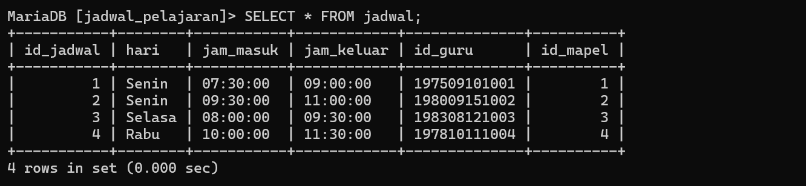
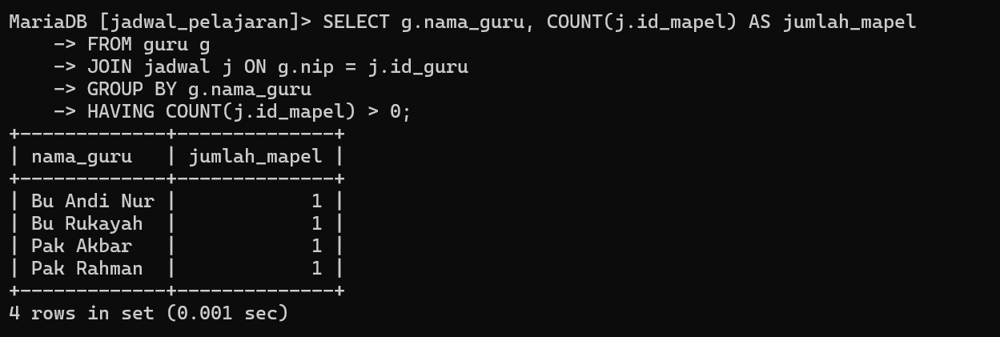
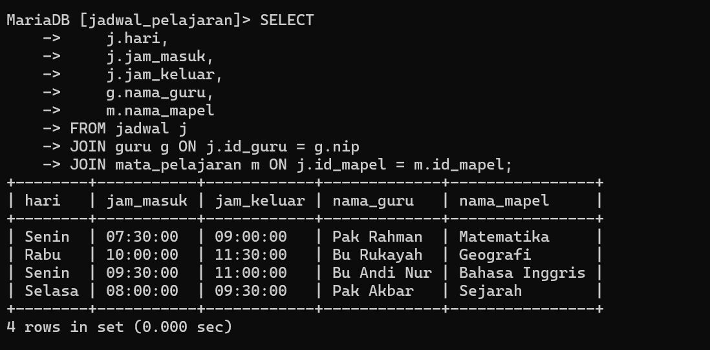

# soal 1

#### **1. Struktur Database**

- **Tujuan**:  
    Database yang dirancang terdiri dari empat tabel utama yang saling berhubungan untuk mendukung sistem jadwal pelajaran. Tabel-tabel tersebut adalah:
    
    - **Tabel `kelas`**: Menyimpan informasi tentang kelas, seperti tingkat dan nama kelas.
    - **Tabel `mata_pelajaran`**: Berisi data mengenai mata pelajaran, termasuk deskripsi masing-masing mata pelajaran.
    - **Tabel `guru`**: Menyimpan data pribadi guru, seperti NIP, nama, email, nomor telepon, dan alamat.
    - **Tabel `jadwal`**: Merupakan tabel penghubung yang menyimpan informasi jadwal pelajaran yang menghubungkan data guru dan mata pelajaran.
- **Kelebihan**:
    
    - **Normalisasi**: Struktur database ini sudah mengikuti prinsip normalisasi, yang berarti mengurangi redundansi data dan meningkatkan efisiensi.
    - **Foreign Key**: Penggunaan foreign key menghubungkan antar tabel dan memastikan data yang konsisten.
    - **Constraints**: Dengan menggunakan constraints, seperti `UNIQUE` pada email guru, database ini dapat menghindari entri yang duplikat.
- **Kelemahan**:
    
    - Jika terjadi perubahan besar dalam kurikulum atau pembagian kelas, maka tabel `jadwal` mungkin perlu diperbarui.

---

#### **2. Tabel `kelas`**

- **Struktur**:
    
    ```sql
    CREATE TABLE kelas (
        id_kelas INT AUTO_INCREMENT PRIMARY KEY,
        tingkat VARCHAR(10) NOT NULL,
        nama_kelas VARCHAR(50) NOT NULL
    );
    ```

Gambar


- **Analisis**:
    
    - **`id_kelas`**: Primary key untuk memastikan setiap kelas memiliki identifikasi unik.
    - **`tingkat` dan `nama_kelas`**: Menyimpan informasi mengenai tingkat dan nama kelas, misalnya kelas 10, 11, atau 12.
- **Potensi Perluasan**:
    
    - Kolom seperti kapasitas kelas atau nama wali kelas bisa ditambahkan untuk memperluas informasi yang tersedia.

---

#### **3. Tabel `mata_pelajaran`**

- **Struktur**:
    
    ```sql
    CREATE TABLE mata_pelajaran (
        id_mapel INT AUTO_INCREMENT PRIMARY KEY,
        nama_mapel VARCHAR(100) NOT NULL,
        deskripsi TEXT
    );
    ```

Gambar


- **Analisis**:
    
    - **`id_mapel`**: Sebagai primary key, setiap mata pelajaran mendapatkan identifikasi unik.
    - **`deskripsi`**: Memberikan informasi tambahan tentang setiap mata pelajaran yang mungkin dibutuhkan oleh pengelola jadwal.
- **Potensi Perluasan**:
    
    - Bisa menambahkan kolom seperti jumlah SKS atau kategori mata pelajaran (wajib atau pilihan) untuk analisis yang lebih mendalam.

---

#### **4. Tabel `guru`**

- **Struktur**:
    
    ```sql
    CREATE TABLE guru (
        nip VARCHAR(20) PRIMARY KEY,
        nama_guru VARCHAR(100) NOT NULL,
        email VARCHAR(100) NOT NULL UNIQUE,
        no_telpon VARCHAR(15),
        alamat TEXT
    );
    ```

Gambar


- **Analisis**:
    
    - **`nip`**: Primary key yang menjamin setiap guru memiliki identifikasi unik.
    - **`email`**: Kolom ini memiliki constraint `UNIQUE` untuk memastikan tidak ada dua guru dengan email yang sama.
    - **`no_telpon` dan `alamat`**: Memberikan informasi kontak tambahan yang berguna untuk menghubungi guru.
- **Kelebihan**:
    
    - Informasi yang disediakan cukup lengkap dan relevan untuk keperluan sistem jadwal.
- **Kelemahan**:
    
    - Format NIP yang mungkin berubah seiring waktu bisa mempengaruhi keutuhan data, terutama jika ada standar baru untuk NIP.

---

#### **5. Tabel `jadwal`**

- **Struktur**:
    
    ```sql
    CREATE TABLE jadwal (
        id_jadwal INT AUTO_INCREMENT PRIMARY KEY,
        hari VARCHAR(15) NOT NULL,
        jam_masuk TIME NOT NULL,
        jam_keluar TIME NOT NULL,
        id_guru VARCHAR(20) NOT NULL,
        id_mapel INT NOT NULL,
        FOREIGN KEY (id_guru) REFERENCES guru (nip) ON DELETE CASCADE ON UPDATE CASCADE,
        FOREIGN KEY (id_mapel) REFERENCES mata_pelajaran (id_mapel) ON DELETE CASCADE ON UPDATE CASCADE
    );
    ```

Gambar


- **Analisis**:
    
    - **`id_jadwal`**: Primary key yang memastikan bahwa setiap entri jadwal memiliki identifikasi unik.
    - **Relasi dengan Tabel `guru` dan `mata_pelajaran`**: Menghubungkan tabel `jadwal` dengan data guru dan mata pelajaran. Ini memastikan setiap jadwal terkait dengan guru dan mata pelajaran yang tepat.
    - **`ON DELETE CASCADE`**: Jika guru atau mata pelajaran dihapus, jadwal yang terkait juga akan terhapus otomatis. Ini menjaga data tetap konsisten.
- **Kelemahan**:
    
    - Tabel ini tidak mencakup atribut seperti lokasi kelas atau perangkat yang digunakan (misalnya proyektor) yang bisa berguna untuk informasi lebih lengkap.

---

#### **Kesimpulan**

- **Keunggulan**:
    
    - Database ini dirancang dengan efisien, menjaga konsistensi data antar tabel. Penggunaan foreign key dan constraints seperti `UNIQUE` memberikan integritas yang kuat terhadap data.
    - Sistem ini dapat mendukung pengelolaan jadwal pelajaran dengan baik karena relasi antar tabel yang jelas dan konsisten.
- **Potensi Perbaikan**:
    
    - Bisa ditambahkan informasi lebih lanjut di tabel `jadwal` mengenai lokasi kelas atau perangkat pembelajaran yang digunakan.
    - Tabel `mata_pelajaran` bisa diperluas dengan kolom tambahan seperti jumlah SKS atau kategori mata pelajaran untuk mempermudah analisis kurikulum.

**Harapan**: Database yang telah dirancang ini diharapkan bisa digunakan dengan baik dalam pengelolaan sistem jadwal pelajaran yang efisien di sekolah-sekolah di Makassar, dan dapat memberikan manfaat optimal dalam mendukung proses pembelajaran.
# soal 2
### **Analisis Contoh 1**

```sql
SELECT g.nama_guru, COUNT(j.id_mapel) AS jumlah_mapel
FROM guru g
JOIN jadwal j ON g.nip = j.id_guru
GROUP BY g.nama_guru
HAVING COUNT(j.id_mapel) > 0;
```

**Penjelasan:**

- **SELECT**: Untuk memilih kolom mana saja yang ingin ditampilkan pada hasil query.
- **g.nama_guru**: Nama kolom yang diambil dari tabel `guru` dan akan ditampilkan.
- **COUNT(j.id_mapel)**: Menghitung jumlah baris pada tabel `jadwal` yang memiliki data pada kolom `id_mapel`. Ini menunjukkan jumlah mata pelajaran yang diajarkan oleh masing-masing guru.
- **AS jumlah_mapel**: Memberikan nama sementara untuk hasil perhitungan `COUNT(j.id_mapel)`. Nama ini digunakan sebagai alias, sehingga hasil akan ditampilkan sebagai kolom `jumlah_mapel`.
- **FROM guru g**: Memilih tabel `guru` sebagai sumber data utama.
- **JOIN jadwal j ON g.nip = j.id_guru**: Menghubungkan tabel `guru` dengan tabel `jadwal` berdasarkan kolom `nip` di tabel `guru` yang sesuai dengan kolom `id_guru` di tabel `jadwal`.
- **GROUP BY g.nama_guru**: Mengelompokkan data berdasarkan nama guru, sehingga setiap baris hasil merupakan ringkasan data untuk setiap guru.
- **HAVING COUNT(j.id_mapel) > 0**: Menyaring hasil kelompok data sehingga hanya menampilkan guru yang mengajar setidaknya satu mata pelajaran.

**Hasil Query**:

- Akan menampilkan nama-nama guru beserta jumlah mata pelajaran yang mereka ajarkan.
- Guru yang tidak mengajar mata pelajaran apa pun tidak akan ditampilkan dalam hasil.

---

### **Analisis Contoh 2**

```sql
SELECT 
    j.hari, 
    j.jam_masuk, 
    j.jam_keluar, 
    g.nama_guru, 
    m.nama_mapel
FROM jadwal j
JOIN guru g ON j.id_guru = g.nip
JOIN mata_pelajaran m ON j.id_mapel = m.id_mapel;
```

**Penjelasan:**

- **SELECT**: Untuk memilih kolom-kolom yang ingin ditampilkan pada hasil query.
- **j.hari, j.jam_masuk, j.jam_keluar**: Kolom yang diambil dari tabel `jadwal`, berisi informasi tentang hari, jam masuk, dan jam keluar mata pelajaran.
- **g.nama_guru**: Kolom dari tabel `guru` yang akan ditampilkan, berisi nama guru yang bertugas.
- **m.nama_mapel**: Kolom dari tabel `mata_pelajaran`, berisi nama mata pelajaran yang diajarkan.
- **FROM jadwal j**: Memilih tabel `jadwal` sebagai sumber data utama.
- **JOIN guru g ON j.id_guru = g.nip**: Menghubungkan tabel `jadwal` dengan tabel `guru` berdasarkan kolom `id_guru` di tabel `jadwal` yang sesuai dengan kolom `nip` di tabel `guru`.
- **JOIN mata_pelajaran m ON j.id_mapel = m.id_mapel**: Menghubungkan tabel `jadwal` dengan tabel `mata_pelajaran` berdasarkan kolom `id_mapel` di kedua tabel.

**Hasil Query**:

- Menampilkan daftar jadwal lengkap, termasuk informasi hari, jam masuk, jam keluar, nama guru yang mengajar, dan nama mata pelajaran.
- Setiap baris hasil merepresentasikan satu entri jadwal dengan informasi terhubung dari tabel `guru` dan `mata_pelajaran`.

---

# Tabel_Keaktifan

![![KELOMPOK 6/#^Table2]]

